# nales

<p align="center">
  
</p>

**LBTI/ALES Integral Field Spectrograph Data Reduction Pipeline**

[](https://python.org)
[](https://opensource.org/licenses/MIT)

---

## Table of Contents

- [Overview](#overview)
- [Installation](#installation)
- [Preparing Your Data Directory](#preparing-your-data-directory)
- [Workflow](#workflow)
  - [Step 1: Process Wavelength Calibration](#step-1-process-wavelength-calibration)
  - [Step 2: Build the Median Sky](#step-2-build-the-median-sky)
  - [Step 3: Build the Cubifier](#step-3-build-the-cubifier)
  - [Step 4: Extract Cubes](#step-4-extract-cubes)
- [High-Contrast Imaging with pyKLIP](#high-contrast-imaging-with-pyklip)
- [Key Concepts](#key-concepts)
- [API Reference](#api-reference)
- [Diagnostic Tools](#diagnostic-tools)
- [Troubleshooting](#troubleshooting)
- [Acknowledgments](#acknowledgments)
- [Citation](#citation)
- [License](#license)

---

## Overview

nales ("new ALES") is a Python package for reducing data from **ALES** (Arizona Lenslets for Exoplanet Spectroscopy), an integral field spectrograph on the Large Binocular Telescope Interferometer (LBTI). The name reflects the package's evolution: the original `ales` pipeline was succeeded by `mead`, and following significant instrument upgrades that changed the data format, `nales` was developed to support the current instrument configuration.

ALES provides high-contrast imaging spectroscopy at thermal infrared wavelengths (2.9-4.1 μm) with R~70 over a 2" square field of view. The instrument uses a lenslet array to sample the diffraction-limited PSF, producing a grid of microspectra on the detector.

This package transforms raw 2D detector images into calibrated 3D spectral cubes (wavelength × spatial × spatial), and provides integration with [pyKLIP](https://pyklip.readthedocs.io/) for PSF subtraction and flux-calibrated spectral extraction.

---

## Installation

### Using Conda (Recommended)

```bash
conda create -n nales python=3.11
conda activate nales

git clone https://github.com/jordan-stone/nales.git
cd nales
pip install -e .
```

### Installing from the Development Branch

To install the latest development version with new features (including pyKLIP analysis support):

```bash
git clone https://github.com/jordan-stone/nales.git
cd nales
git checkout development

# Basic installation (data reduction only)
pip install -e .

# Or, include pyKLIP for high-contrast imaging analysis
pip install -e ".[pyklip]"
```

### Verify Installation

```python
import nales
print(nales.__version__)
from nales import Cubifier, SkyBuilder, CubeExtractor
print("nales installed successfully!")

# Check if pyklip support is available
from nales.analysis import is_pyklip_available
print(f"pyKLIP available: {is_pyklip_available()}")
```

### Dependencies

Core dependencies (installed automatically):

- NumPy >= 1.20
- SciPy >= 1.7
- Astropy >= 5.0
- Matplotlib >= 3.5
- [jfits](https://pypi.org/project/jfits/) >= 1.0.0

Optional dependencies:

- [pyklip](https://pyklip.readthedocs.io/) >= 2.9 (for high-contrast imaging analysis)

---

## Preparing Your Data Directory

ALES observing nights produce thousands of FITS files. For efficient processing, create a working directory with symlinks to only the files you need.

Using your observing log, identify file numbers for:
- Wavelength calibration frames (narrow-band filter images + darks)
- Science target frames (including sky nods)
- Telluric calibrator frames (including sky nods)

Use bash brace expansion to create symlinks:

```bash
# Create working directories
mkdir -p wavecal/raw science_target/raw telluric_target/raw cubes

# Symlink wavecal frames (adjust numbers for your data)
cd wavecal/raw
for f in /path/to/raw/lmircam_{0100..0200}.fits; do ln -s "$f"; done
cd ../..

# Symlink science target frames
cd science_target/raw
for f in /path/to/raw/lmircam_{0500..0800}.fits; do ln -s "$f"; done
cd ../..

# Symlink telluric calibrator frames
cd telluric_target/raw
for f in /path/to/raw/lmircam_{0900..1100}.fits; do ln -s "$f"; done
cd ../..
```

---

## Workflow

### Step 1: Process Wavelength Calibration

`organize_wavecal_frames()` handles all calibration preprocessing:

```python
import nales

# From within wavecal/
wave_cal_ims, light_leak = nales.organize_wavecal_frames('raw/')
```

This automatically:
- Sorts files by filter and exposure time
- Creates median darks
- Dark-subtracts narrow-band images
- Applies CDS+ and bad pixel corrections
- Computes and subtracts light leak
- Saves `light_leak_median.fits` for use with sky frames

Output files created:
- `darks/median_XXXX.XX.fits` - Median dark frames (XXXX.XX is exposure time in ms)
- `nb29/`, `nb33/`, `nb35/`, `nb39/` - Organized narrowband frames and reduced images (`cdsp_nbXX_median_ds.fits`)
- `bpm_and_these_hots.fits` - Bad pixel mask
- `bad_and_neighbors_bpm_and_these_darks.pkl` - Pre-computed bad pixel corrections
- `light_leak_median.fits` - Light leak model

### Step 2: Build the Median Sky

Use `SkyBuilder` to identify frames and build a median sky.

**Note:** nales implicitly trusts that observations were made using standard ALES observing scripts that set the header `FLAG` keyword through the nod sequence. `builder.identify_frames()` uses this keyword to distinguish sky and science frames. If data were collected differently or the observing log notes issues with header flags, you may need to manually adjust the `FLAG` keyword values for nales to function correctly.

```python
builder = nales.SkyBuilder('science_target/raw/')
builder.identify_frames()
builder.summary()  # Review frame breakdown
builder.save('science_target/target_frames.pkl')

# Note: Replace XXXX.XX with your actual dark exposure time in ms
# Note: If sky and wavecal exposure times differ, set light_leak_scale = sky_exptime / wavecal_exptime
median_sky = builder.build_median_sky(
    dark_file='wavecal/darks/median_XXXX.XX.fits',
    bad_pixel_file='wavecal/bad_and_neighbors_bpm_and_these_darks.pkl',
    light_leak_file='wavecal/light_leak_median.fits',
    light_leak_scale=1.0,
    chunk_size=512,  # Process in chunks to limit memory; must divide 2048 evenly
    output='science_target/median_sky.fits'
)
```

**Memory note:** The `chunk_size` parameter controls memory usage during median combination. With `chunk_size=2048` (full frame), combining 400 images can use 60+ GB of RAM. Use smaller values (512, 256) on systems with limited memory. The value must divide evenly into 2048.

<p align="center">
  
  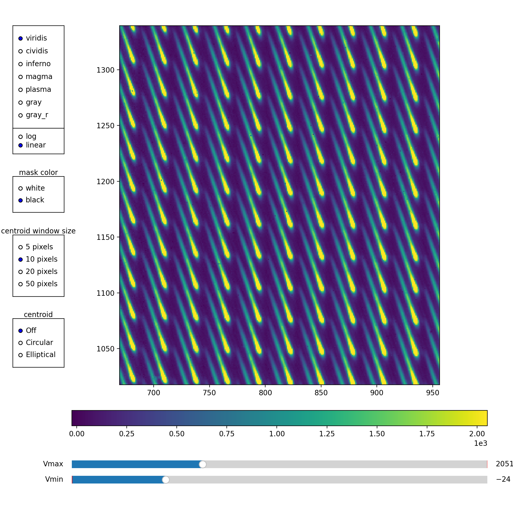
</p>

*Median sky image visualized with `jfits.InteractiveDisplay(median_sky)`. Right panel shows a zoom on the central microspectra where optical quality is highest.*

### Step 3: Build the Cubifier

**Important**: The `start_offsets` parameter is required and must be determined by visual inspection of the NB39 image. This value will change by tens of pixels each time the lenslet array is moved out and back in, so it must be re-determined for each observing run.

```python
import jfits

# Use interactive display to find lower-left spot coordinates
jfits.InteractiveDisplay(wave_cal_ims['nb39'])
# Find the (x, y) position of the lower-left spot at the intersection
# of the lowest complete row and leftmost complete column
```

<p align="center">
  
  
</p>

*NB39 spot grid showing the lower-left reference spot highlighted with red contours. The title displays the centroid location used for `start_offsets`.*

Then build the Cubifier:

```python
import numpy as np

cubifier = nales.Cubifier(
    wave_cal_ims,
    median_sky,
    sky_var=np.ones_like(median_sky),  # Uniform variance works well
    start_offsets=(73, 192),  # REQUIRED - (x, y) from inspecting NB39
)

# Save for later use
import pickle
with open('science_target/Cubifier.pkl', 'wb') as f:
    pickle.dump(cubifier, f)
```

### Step 4: Extract Cubes

Use `CubeExtractor` for batch processing:

```python
extractor = nales.CubeExtractor(
    cubifier=cubifier,
    sky_builder=builder,
    bad_pixel_file='wavecal/bad_and_neighbors_bpm_and_these_darks.pkl'
)
extractor.run(output_dir='cubes/', n_sky_frames=50)
```

For large datasets, split into preprocessing and cubification:

```python
extractor.preprocess_only(output_dir='preprocessed/', n_sky_frames=50)
extractor.cubify_preprocessed(input_dir='preprocessed/', output_dir='cubes/')
```

---

## High-Contrast Imaging with pyKLIP

nales includes integration with [pyKLIP](https://pyklip.readthedocs.io/) for high-contrast imaging analysis. This enables PSF subtraction using KLIP (Karhunen-Loève Image Processing), forward-model spectral extraction, and flux calibration to physical units.

### Quick Start

```python
from nales.analysis import ALESData

# Load reduced datacubes
dataset = ALESData('cubes/cube_*.fits', highpass=True)
print(dataset)

# Generate PSFs for forward modeling
# Option 1: From auxiliary calibrator (exposure times read from headers)
dataset.generate_psfs(
    aux_psf_files='calibrator/cal_cube.fits',
    normalize='none'      # Keep DN for flux calibration
)

# Option 2: From central star in science frames
dataset.generate_psfs(normalize='none')

# Set up flux calibration using stellar model + WISE W1 photometry
dataset.compute_dn_per_contrast(W1_mag=5.23, spectral_type='G2V')

# Run KLIP
import pyklip.parallelized as parallelized
parallelized.klip_dataset(
    dataset,
    outputdir='klip_output/',
    fileprefix='target',
    annuli=9,
    subsections=4,
    movement=1,
    numbasis=[1, 5, 10, 20, 50],
    mode='ADI+SDI'
)

# After KLIP-FM spectral extraction:
planet_flux = dataset.calibrate_contrast_spectrum(contrast_spectrum)
# planet_flux is now in Jy
```

### PSF Centroiding Options

The `generate_psfs()` function supports multiple centroiding methods:

```python
# 2D Gaussian fit (default, best for point sources)
dataset.generate_psfs(centroid_method='gaussian')

# Center of mass
dataset.generate_psfs(centroid_method='com')

# Peak pixel location
dataset.generate_psfs(centroid_method='peak')

# Radon transform (best for diffraction spikes, uses pyklip)
dataset.generate_psfs(centroid_method='radon')
```

The `'radon'` method uses pyKLIP's implementation of the Radon transform algorithm from [Pueyo et al. (2015)](https://ui.adsabs.harvard.edu/abs/2015ApJ...803...31P), which finds the stellar center by maximizing flux along diffraction spike angles. This is particularly useful for coronagraphic data.

### Flux Calibration

The flux calibration workflow converts KLIP-extracted contrast spectra to physical flux units:

1. **PSF in DN**: Raw detector counts preserving chromatic throughput
2. **Stellar model**: Pickles library spectrum scaled to WISE W1 photometry
3. **dn_per_contrast**: Conversion factor = PSF_flux / stellar_model_flux
4. **Planet flux**: contrast × stellar_model_flux

```python
# The stellar model is automatically retrieved and scaled
dataset.compute_dn_per_contrast(
    W1_mag=5.23,           # WISE W1 magnitude (look up on SIMBAD/VizieR)
    spectral_type='G2V',   # Spectral type for Pickles model
    output_units='Jy'      # or 'W/m2/um'
)

# Access the stellar model for reference
import matplotlib.pyplot as plt
plt.plot(dataset.stellar_model_wvs, dataset.stellar_model_flux)
plt.xlabel('Wavelength (μm)')
plt.ylabel('Flux (Jy)')
```

### Further Reading

- [pyKLIP Documentation](https://pyklip.readthedocs.io/)
- [pyKLIP CHARIS Tutorial](https://pyklip.readthedocs.io/en/latest/instruments/CHARIS.html) (similar IFS workflow)
- [KLIP Algorithm Paper](https://ui.adsabs.harvard.edu/abs/2012ApJ...755L..28S) (Soummer et al. 2012)
- [Forward Modeling Paper](https://ui.adsabs.harvard.edu/abs/2016ApJ...824..117P) (Pueyo 2016)

---

## Key Concepts

### Cube Structure

Output cubes have shape `(n_wavelengths, n_rows, n_cols)` where:
- `n_wavelengths` = 99 spectral channels (2.9-4.1 μm)
- `n_rows` × `n_cols` = 63 × 67 spatial pixels (default)

Wavelengths are stored in a binary table extension (HDU 1) with column `WAVELENGTH` in microns.

### Light Leak Correction

ALES has a static light leak pattern contaminating calibration and sky frames. nales computes this as the median of all narrowband images and subtracts it automatically.

---

## API Reference

### Cubifier

The main class for wavelength calibration and cube extraction.

```python
cubifier = nales.Cubifier(
    wave_cal_ims,      # dict: 'nb29', 'nb33', 'nb35', 'nb39' images
    sky_im,            # 2D median sky image
    sky_var,           # 2D variance (np.ones_like works well)
    start_offsets,     # REQUIRED: (x, y) of lower-left NB39 spot
    dims=(63, 67),     # Output spatial dimensions (rows, cols of spaxels)
    make_slice_bottoms=True,   # Compute slice boundaries for indexing microspectra
    gridplot=False,    # Display final diagnostic plot of detected NB39 spot grid
    spoof_nb29=True,   # Improve NB29 positions using NB39 as reference
    spoof_nb33=False,  # Improve NB33 positions using NB39 as reference
    best_spots_slice=(slice(920, 1020), slice(900, 1000)),  # Region for spot alignment
    use_middle_weights=False,  # Use median spatial profile for all wavelengths
    trim_crosstalk=False,      # Avoid extracting crosstalk in blue wavelengths
)
```

**Parameters explained:**

- **`start_offsets`** (required): Approximate (x, y) pixel position of the lower-left reference spot in the NB39 image. Must be determined by visual inspection.

- **`make_slice_bottoms`**: When True, computes the slice boundaries around each NB39 spot, enabling each microspectrum to be indexed from the full detector array.

- **`gridplot`**: When True, displays a final diagnostic plot showing where NB39 spots were detected. Useful for debugging if spots aren't found in a regular grid pattern.

- **`spoof_nb29`**, **`spoof_nb33`**: ALES optical quality is typically best near the frame center. For low S/N narrowband images, spots near the edges may be poorly detected. These options measure the offset between NB39 and NB29/NB33 in the high-quality region (`best_spots_slice`), then apply that offset to estimate spot positions across the full frame.

- **`best_spots_slice`**: Defines the detector region with highest quality spots, used when spoofing NB29/NB33 positions.

- **`use_middle_weights`**: When True, uses the median spatial profile from mid-band wavelengths for extraction at all wavelengths, rather than wavelength-dependent profiles.

- **`trim_crosstalk`**: When True, avoids extracting the right side of each microspectrum's spatial profile in the blue third of wavelengths, reducing contamination from adjacent spectra.

### SkyBuilder

```python
builder = nales.SkyBuilder(directory)
builder.identify_frames()
builder.save(filename)

median_sky = builder.build_median_sky(
    dark_file,
    bad_pixel_file,
    light_leak_file=None,
    light_leak_scale=1.0,
    chunk_size=512,    # Must divide 2048 evenly; smaller = less memory
    output=None
)
```

### CubeExtractor

```python
extractor = nales.CubeExtractor(
    cubifier,          # Cubifier object or path to pickle
    frame_ids,         # SkyBuilder object or path to pickle with frame classifications
    bad_pixel_file,
    raw_directory=None
)

extractor.run(output_dir, n_sky_frames=50)
extractor.preprocess_only(output_dir, n_sky_frames=50)
extractor.cubify_preprocessed(input_dir, output_dir)
```

### Analysis (requires pyklip)

```python
from nales.analysis import ALESData

dataset = ALESData(
    filepaths,         # Glob pattern or list of FITS files
    highpass=False,    # Apply high-pass filter
    skipslices=None,   # Wavelength indices to skip
    IWA=0,             # Inner working angle (pixels)
    OWA=None,          # Outer working angle (pixels, default=image size/2)
)

dataset.generate_psfs(
    boxrad=10,                    # Half-width of PSF stamp
    aux_psf_files=None,           # Auxiliary calibrator file(s)
    aux_exptime=None,             # Calibrator exposure time
    sci_exptime=None,             # Science exposure time
    normalize='none',             # 'none', 'per_channel', or 'cube'
    centroid_method='gaussian',   # 'gaussian', 'com', 'peak', or 'radon'
)

dataset.compute_dn_per_contrast(
    W1_mag,                       # WISE W1 magnitude
    spectral_type=None,           # e.g., 'G2V'
    Teff=None,                    # Alternative to spectral_type
    output_units='Jy',            # 'Jy' or 'W/m2/um'
)

planet_flux = dataset.calibrate_contrast_spectrum(contrast_spectrum)
```

### Utility Modules

- `nales.utils.wavecal` - Wavelength calibration (spot grids, fitting)
- `nales.utils.bad_pixels` - Bad pixel detection and correction
- `nales.utils.rotation` - Image rotation and trace angles
- `nales.utils.registration` - Sub-pixel image registration
- `nales.analysis` - High-contrast imaging with pyKLIP (ALESData, PSF generation, flux calibration)

---

## Diagnostic Tools

```python
cubifier.inspect_wavecal(spaxel=(30, 30))      # Wavelength calibration
cubifier.inspect_wavecal_nbs(spaxel=(30, 30))  # Narrow-band overlays
cubifier.inspect_rotation(spaxel=(30, 30))     # Trace rotation
cubifier.inspect_weights(spaxel=(30, 30))      # Extraction weights
```

### inspect_wavecal_nbs Examples

`inspect_wavecal_nbs()` overlays narrowband filter spot contours on the sky microspectrum, showing how well the calibration spots align with the spectral trace.

**Center of field (30, 30)** - spots are well localized and well behaved:

<p align="center">
  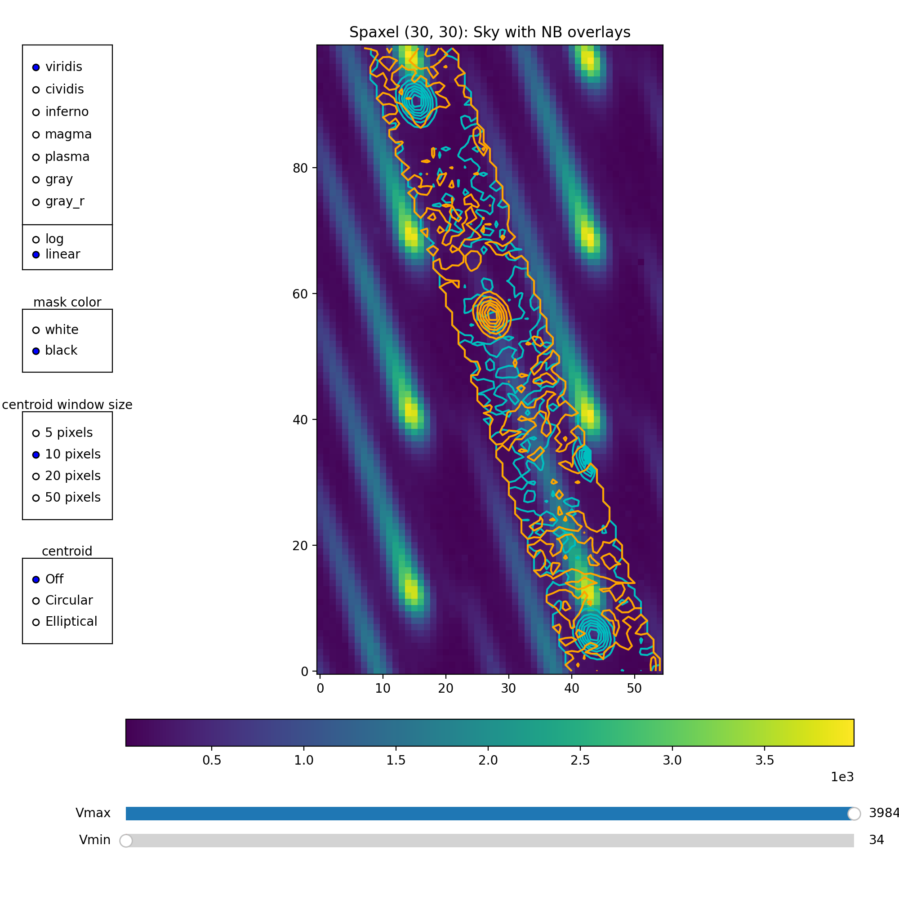
  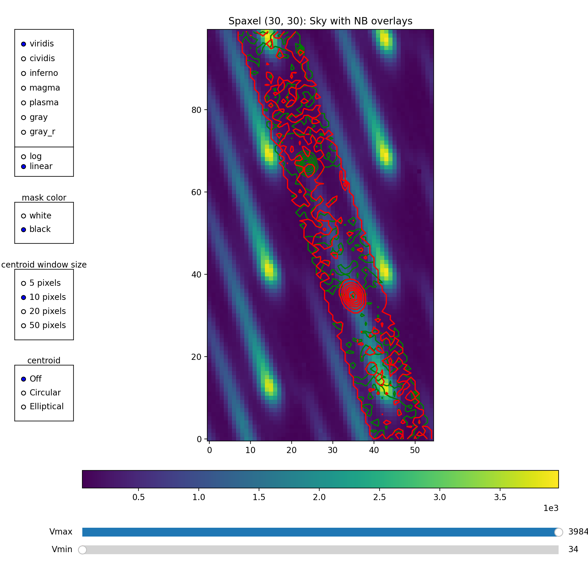
</p>

*Left: NB29 (cyan) and NB35 (orange) contours. Right: NB33 (green) and NB39 (red) contours. The NB29 spots have been spoofed from NB39, so they share the same contour shape but are positioned at 2.9 μm on the spectrum.*

**Edge of field (5, 60)** - NB33 spots are poorly localized due to lower optical quality:

<p align="center">
  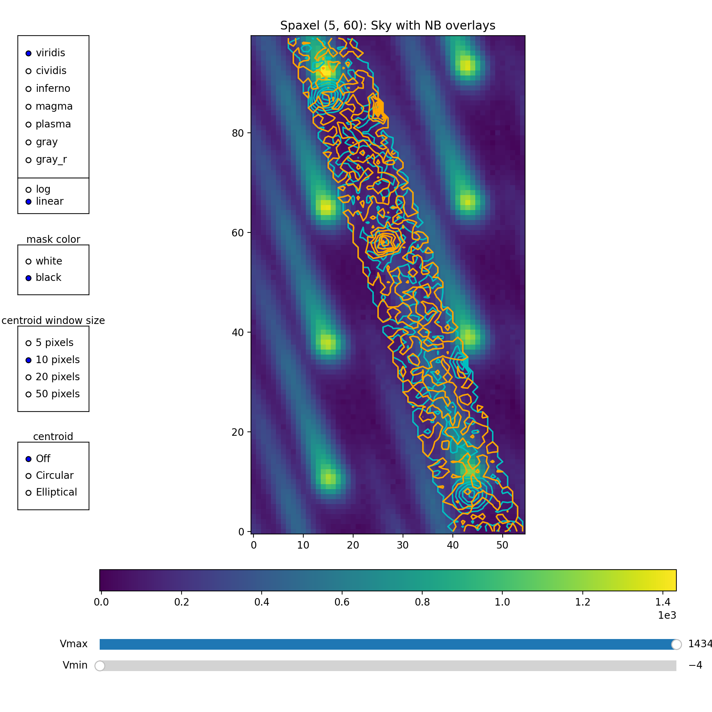
  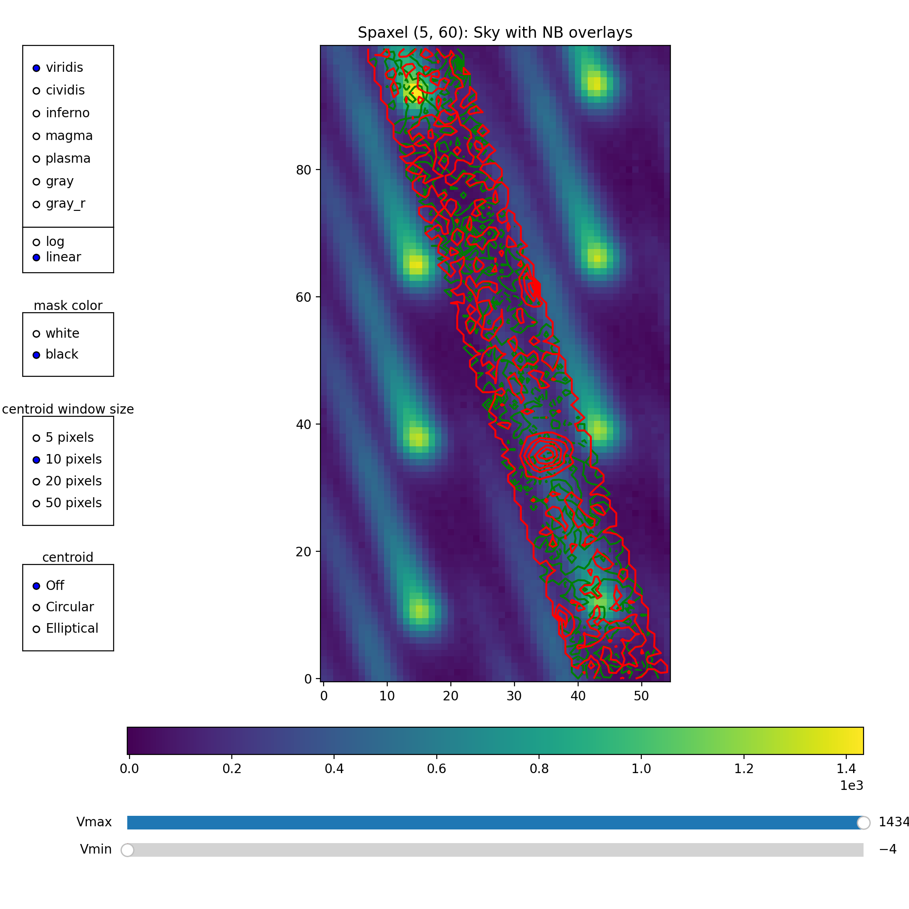
</p>

*Same as above but for spaxel (5, 60) near the field edge. Note the poorly localized green NB33 contours, suggesting potential issues with the 3.3 μm calibration at this location.*

### inspect_wavecal Examples

`inspect_wavecal()` shows the narrowband profiles and fitted wavelength solution.

**Center of field (30, 30)**:

<p align="center">
  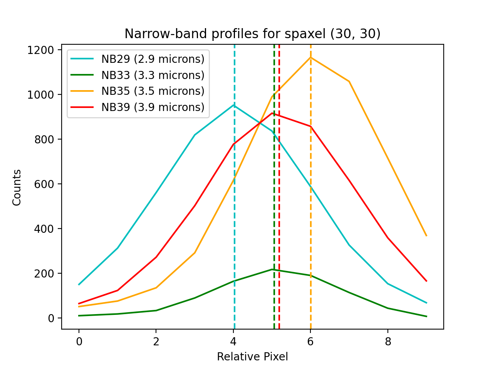
  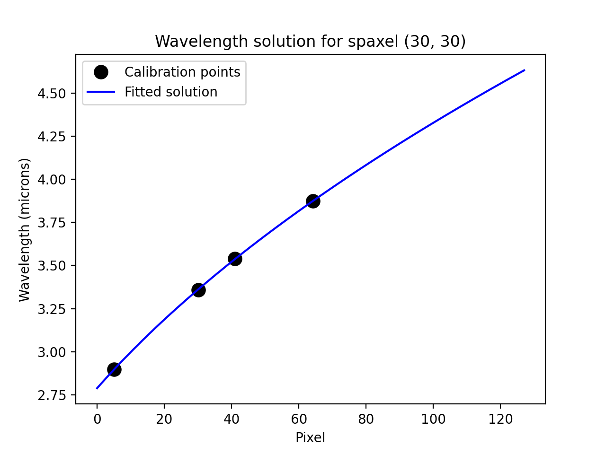
</p>

*Left: Narrowband filter profiles with centroid positions marked. Right: Pixel vs wavelength with the fitted square-root function.*

**Edge of field (5, 60)**:

<p align="center">
  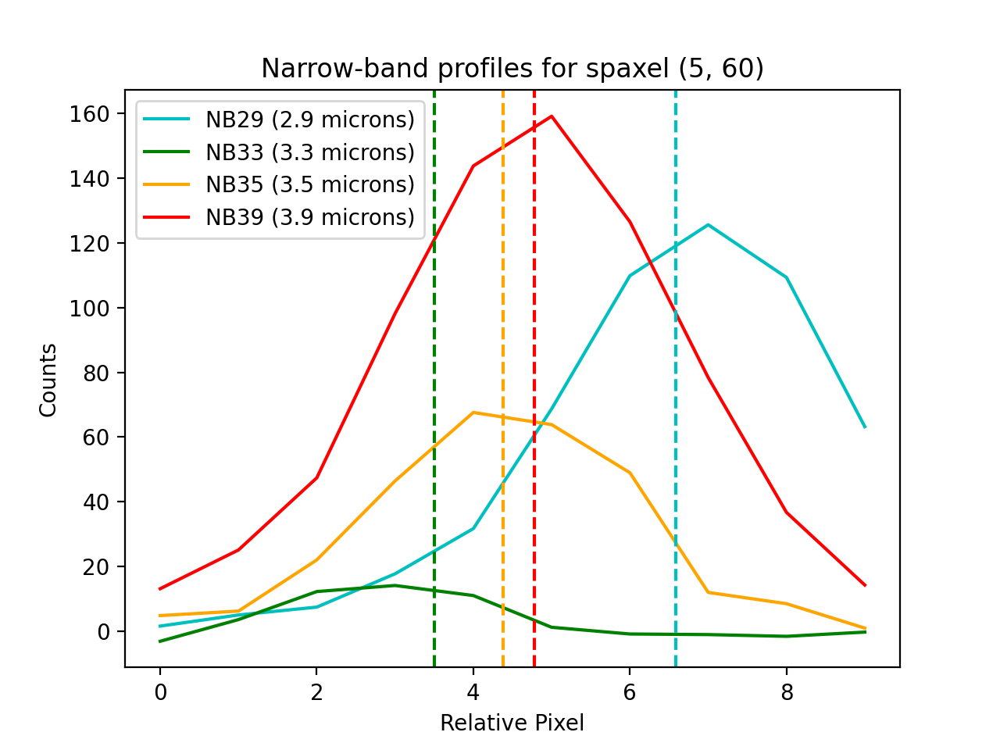
  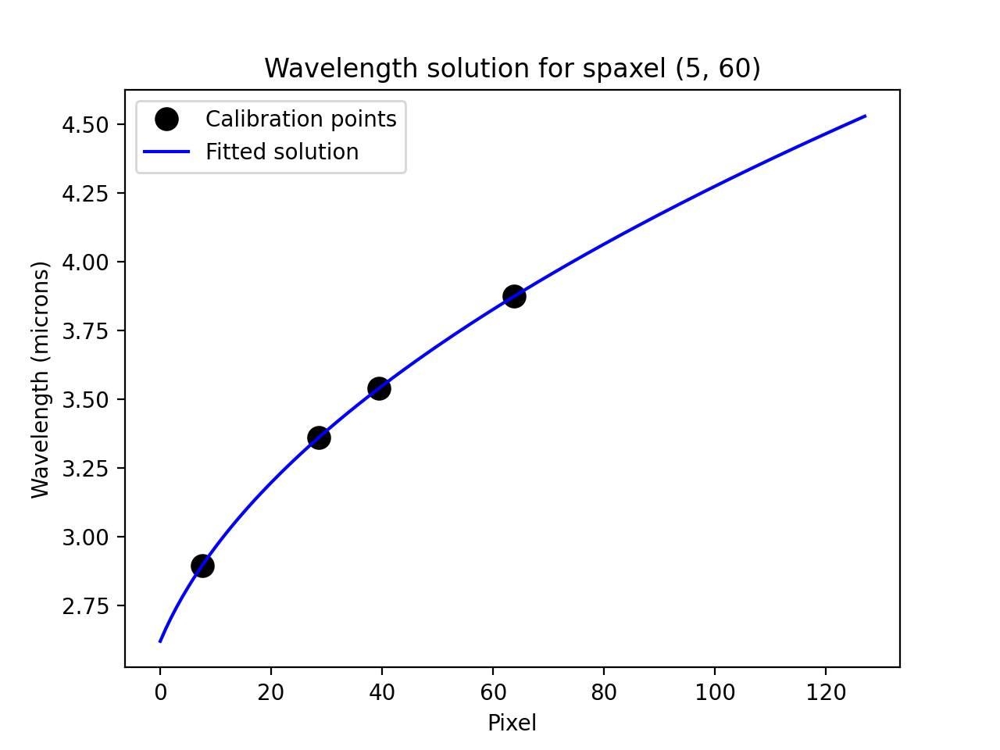
</p>

*Same diagnostics for spaxel (5, 60). The NB33 profile shows potential issues with centroiding. However, the wavelength solution fit remains well-behaved, suggesting NB33 isn't creating an outlier. If concerned, try `spoof_nb33=True`.*

### inspect_weights Examples

`inspect_weights()` displays the extraction weights used when converting 2D microspectra to 1D spectra.

<p align="center">
  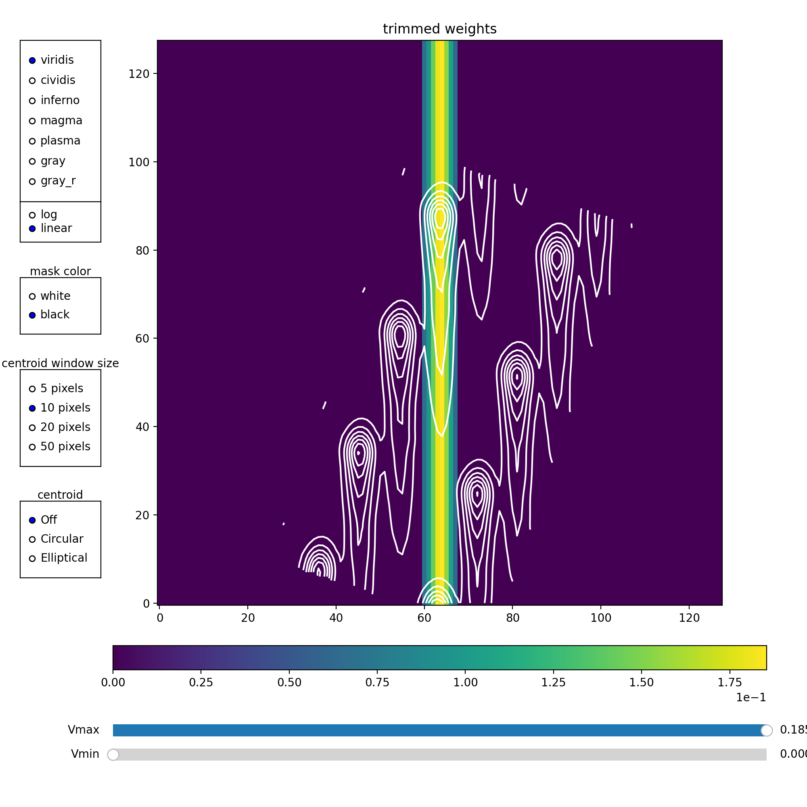
  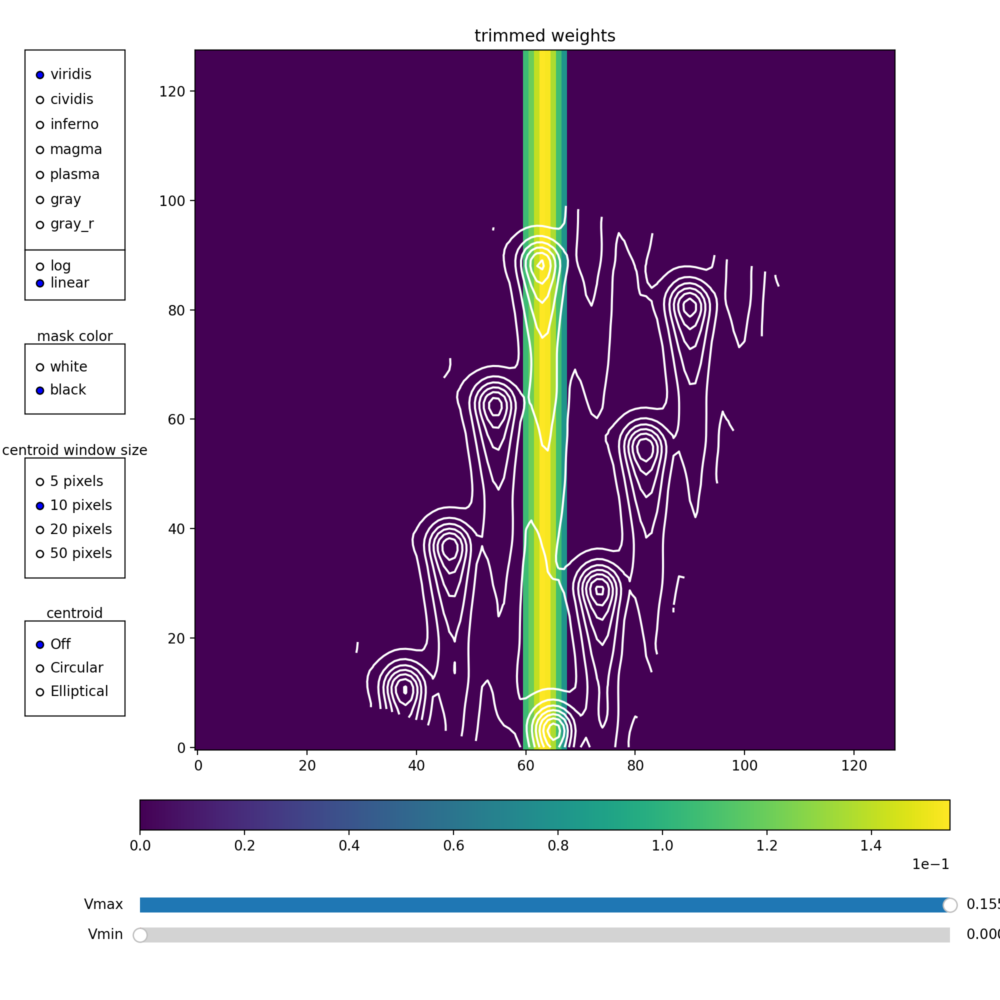
</p>

*Left: Extraction weights for spaxel (30, 30) at field center - tight, well-defined trace. Right: Spaxel (5, 60) at field edge - broader trace with more potential for crosstalk from neighboring microspectra. White contours show the microspectral traces overlaid on the extraction weights.*

---

## Troubleshooting

### Import Errors

```bash
pip install numpy scipy astropy matplotlib jfits
```

### Display Issues

```python
import matplotlib
matplotlib.use('TkAgg')  # or 'Qt5Agg'
import matplotlib.pyplot as plt
plt.ion()
```

### Memory Issues

ALES produces large cubes. Ensure 16GB+ RAM and use `CubeExtractor` for batch processing with chunked memory management. For `SkyBuilder.build_median_sky()`, reduce `chunk_size` (e.g., 256 or 512) to limit memory usage.

### pyKLIP Not Found

If you get `ImportError` when using the analysis module:

```bash
pip install pyklip
# or reinstall nales with pyklip support:
pip install -e ".[pyklip]"
```

---

## Acknowledgments

nales includes code developed collaboratively with the MEAD pipeline. The sub-pixel registration and spot-spoofing algorithms were extended by Zackery Briesemeister for MEAD and incorporated back into nales. We thank Zack for his contributions.

See: Briesemeister et al. 2018, Proc. SPIE, 10702, 107022Q

The analysis module uses [pyKLIP](https://pyklip.readthedocs.io/) for PSF subtraction and forward modeling. If you use the pyKLIP integration, please also cite pyKLIP:

> Wang, J. J., Ruffio, J.-B., De Rosa, R. J., et al. 2015, Astrophysics Source Code Library, ascl:1506.001

---

## Citation

If you use nales, please cite:

```bibtex
@software{nales,
  author = {Stone, Jordan},
  title = {nales: LBTI/ALES Integral Field Spectrograph Data Reduction Pipeline},
  url = {https://github.com/jordan-stone/nales},
  year = {2024}
}
```

And the ALES papers:

> Stone, J. M., et al. (2022), "On-sky performance and results of the recently upgraded ALES integral field spectrograph", Proc. SPIE, 12184, 121844S. https://doi.org/10.1117/12.2630308

> Skemer, A. J., et al. (2015), "First Light LBT AO Images of HR 8799 bcde at 1.6 and 3.3 microns", ApJ, 753, 14.

---

## License

MIT License - see [LICENSE](LICENSE) for details.

---

**Author**: Jordan Stone  
**Issues**: https://github.com/jordan-stone/nales/issues
